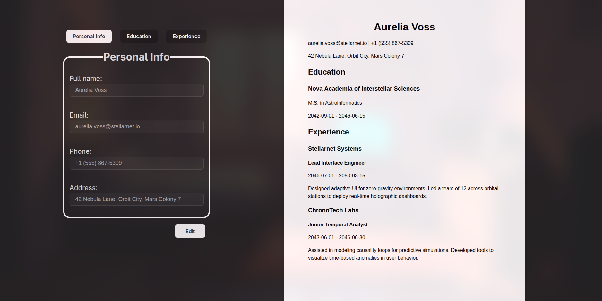

# CV Application (React)

A simple CV/résumé generator built with React. Users can input personal information, education, and work experience, then toggle between edit and preview modes to see their formatted CV.

This project is part of [The Odin Project’s React curriculum](https://www.theodinproject.com/paths/full-stack-javascript/courses/react).

## 📌 Features

- Personal Information
Name, email, phone number, and address.

- Education
Add multiple education entries with school name, title of study, and dates.
Supports adding/removing entries dynamically.

- Experience
Add multiple job entries with company name, position, responsibilities, and dates.
Supports adding/removing entries dynamically.

- Edit / Save Toggle
All sections can be edited when in “Edit” mode.
In “Save” mode, inputs are disabled and a live preview of the CV is shown.

- Live Preview
The right side shows the formatted CV, updating automatically as you edit.

## 📸 Preview


## 🛠️ Technologies Used

- React (with functional components and hooks)

- Vite (development build tool)

- CSS for styling

## 📂 Project Structure

```bash
src/
├── components/
│   ├── GeneralInfo.jsx
│   ├── EducationInfo.jsx
│   ├── ExperienceInfo.jsx
│   └── Preview.jsx
├── styles/
│   ├── App.css
│   └── preview.css
├── App.jsx
├── main.jsx
└── index.css
```

## 📖 How to Run

```bash
# Clone this repo
git clone <your-repo-url>

# Install dependencies
npm install

# Start development server
npm run dev
```

Then open [http://localhost:5173](localhost:5173) in your browser

## 📚 Learning Outcomes

- Practiced state management and controlled components in React.

- Gained experience with props drilling and component composition.

- Learned how to conditionally render UI based on edit/submit state.

- Built a realistic multi-entry form system with add/remove functionality.

## ✅ Odin Requirements Covered

- General info section (name, email, phone)

- Education section (school, title, date of study)

- Experience section (company, position, responsibilities, dates)

- Edit & Submit buttons to toggle between form and display mode

- State & props used to manage and pass data

- Component-based structure with separate files

- Organized styles directory

## 🌟 Extra Features

- Multiple entries for education and experience (Add / Remove)

- Address field in general information

- Semantic HTML (fieldset, legend, section, header)

- “A4 paper” styled preview for print-like formatting
